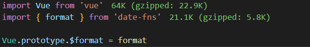

# VS Code 常用插件

## 1. open in browser

该插件可以快速打开浏览器，查看当前 html 文件，支持打开默认浏览器或其他主流浏览器，可以点击右键菜单 -> Open in Default Browser 打开浏览器。

## 2. Live Server

该插件可以为项目启动本地服务器，并支持代码实时修改，可以点击右键菜单 -> Open with Live Server 或者点击 VS Code 右下角 Go Live 启动。

## 3. Auto Rename Tag

该插件支持 html 标签成对修改。


## 4. Code Spell Checker

该插件用于检查单词拼写是否正确，避免变量名写错这种低级语法错误。


## 5. Git History

该插件用于查看项目 Git 项目的提交日志，可以在代码控制面板中点击图标打开。


## 6. Bookmarks

书签工具，在代码对应位置按 Ctrl+Alt+K 可以创建/移除书签，在左侧书签面板可以快速定位代码。


## 7. Markdown Preview Enhanced

Markdown 文档预览工具，可以在右键菜单打开。


## 8. Vetur

Vue 代码高亮和格式化插件。


## 9. Volar

Volar 是适用于 Vue 3 的语法高亮插件，为 Vue 3 和 TS 提供了更加友好的语法提示，安装前需要禁用 Vetur 插件并重启开发环境。


## 10. ESLint

ESLint 语法检查插件，该插件会检测和应用项目中的 .eslintrc.js，并且对不符合规则的代码作出提示，还能对错误进行修改。


如果需要在保存文件的时候自动根据规则修复，可以打开 settings.json 文件：File -> Preferences -> Settings -> Text Editor -> Code Actions On Save -> Edit in settings.json，添加：

```json
{
  "editor.codeActionsOnSave": {
    "source.fixAll.eslint": true
  }
}
```

## 11. Path Autocomplete

路径提示插件，对于 Vue 项目，还可以配置路径别名相关的路径提示，打开 settings.json，添加以下代码：

```json
"path-autocomplete.pathMappings": {
    "@": "${folder}/src/"
}
```

## 12. Bracket Pair Colorizer

用于对成对括号高亮不同的颜色，以此区分。


## 13. Import Cost

用于导入依赖时提示包的体积，方便后期优化。


